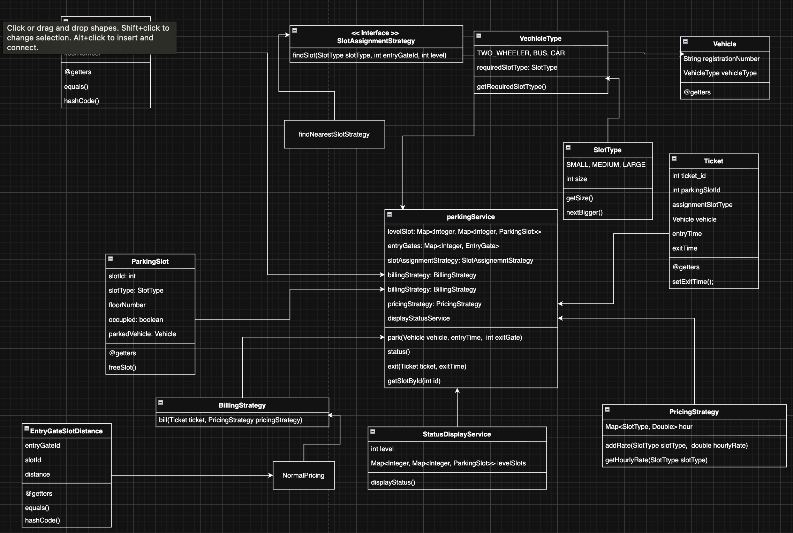

# Parking Lot System — Low-Level Design

A multilevel parking lot management system built in Java, designed with **SOLID principles** and the **Strategy pattern**.

---

## Features

- **Multi-level parking** with configurable floors and slots
- **Vehicle types**: Two-Wheeler, Car, Bus
- **Slot types**: Small, Medium, Large — with automatic **upgrade** if the requested slot is full
- **Pluggable slot assignment** via `SlotAssignmentStrategy` (nearest-to-gate, first-available, etc.)
- **Configurable billing** via `BillingStrategy` (e.g., `NormalBillingStrategy`)
- **Configurable pricing** via `PricingStrategy` with per-slot-type hourly rates
- **Live status display** via `StatusDisplayService`

---

## UML Diagram

;

---


## SOLID Principles Applied

| Principle | How It's Applied |
|---|---|
| **Single Responsibility (SRP)** | `ParkingService` only orchestrates. Slot-finding is in `SlotAssignmentStrategy` implementations. Display is in `StatusDisplayService`. Billing is in `BillingStrategy` implementations. |
| **Open/Closed (OCP)** | New slot allocation algorithms (e.g., random, priority-based) are added by implementing `SlotAssignmentStrategy` — **zero changes** to `ParkingService`. Same for new billing models via `BillingStrategy`. |
| **Liskov Substitution (LSP)** | Any `SlotAssignmentStrategy` implementation can replace another without breaking `ParkingService`. `NearestSlotAssignmentStrategy` and `FirstAvailableSlotStrategy` are fully interchangeable. |
| **Interface Segregation (ISP)** | `SlotAssignmentStrategy` has a single focused method `findSlot()`. `BillingStrategy` has a single focused method `bill()`. No client is forced to depend on methods it doesn't use. |
| **Dependency Inversion (DIP)** | `ParkingService` depends on abstractions (`SlotAssignmentStrategy`, `BillingStrategy`), not on concrete implementations. Strategies are injected via the constructor. |

---

## Class Overview

| Class | Responsibility |
|---|---|
| `ParkingService` | Core orchestrator — delegates to strategies for parking, exit, and status |
| `SlotAssignmentStrategy` | Interface for finding an available parking slot |
| `NearestSlotAssignmentStrategy` | Allocates the nearest available slot to the entry gate (distance-based) |
| `FirstAvailableSlotStrategy` | Allocates the first available slot of the required type (ignores distance) |
| `BillingStrategy` | Interface for calculating the bill |
| `NormalBillingStrategy` | Hourly billing: `ceil(hours) × hourly_rate` |
| `PricingStrategy` | Maps slot types to hourly rates |
| `StatusDisplayService` | Prints parking lot availability per floor |
| `ParkingSlot` | Represents a single parking slot (id, type, floor, occupancy) |
| `EntryGate` | Represents an entry gate on a floor |
| `EntryGateSlotDistance` | Distance between a gate and a slot |
| `Vehicle` | A vehicle with registration number and type |
| `VehicleType` | Enum: `TWO_WHEELER`, `CAR`, `BUS` |
| `SlotType` | Enum: `SMALL`, `MEDIUM`, `LARGE` with upgrade chain |
| `Ticket` | Issued on park, used on exit for billing |

---

## Design Patterns Used

| Pattern | Where | Purpose |
|---|---|---|
| **Strategy** | `SlotAssignmentStrategy` | Swap slot-finding algorithms without modifying `ParkingService` |
| **Strategy** | `BillingStrategy` | Swap billing logic (normal, surge, subscription) without modifying `ParkingService` |
---


## How to Run

```bash
# Compile all Java files
javac *.java

# Run the demo
java Main
```
